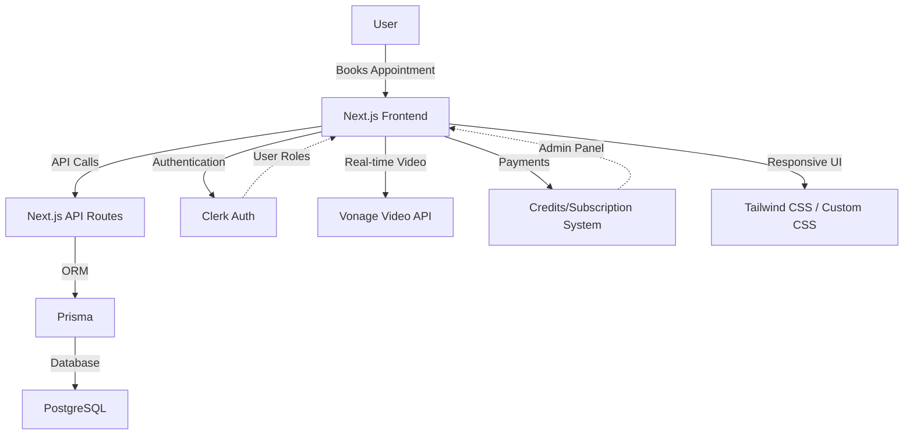
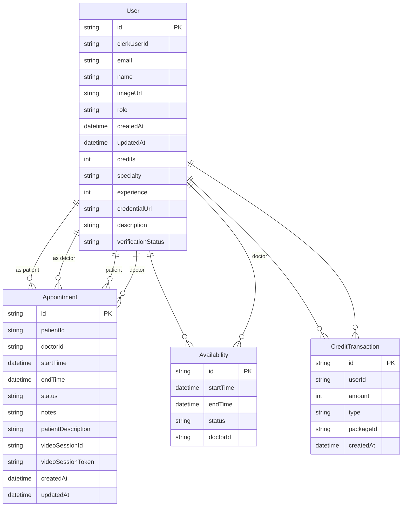

# Medinest - Doctor Appointment Platform

**Medinest** is a modern, full-stack web application that enables patients to connect with verified doctors, book appointments (including video consultations), and manage their healthcare needs online. The platform is designed for patients, doctors, and administrators, providing a seamless, secure, and scalable experience.

---

## Table of Contents

- [Features](#features)
- [Tech Stack](#tech-stack)
- [Architecture](#architecture)
- [Project Structure](#project-structure)
- [Getting Started](#getting-started)
- [Future Roadmap](#future-roadmap)
- [Contributing](#contributing)
- [License](#license)
- [Database Schema](#database-schema)

---

## Features

- **Patient Portal:** Book appointments, manage credits, and access medical documentation.
- **Doctor Dashboard:** Manage appointments, set availability, view patient details, and provide medical notes.
- **Admin Panel:** Oversee users, doctors, appointments, and payouts.
- **Secure Authentication:** Powered by [Clerk](https://clerk.com) for user management.
- **Video Consultations:** Real-time video calls using Vonage Video API.
- **Responsive Design:** Optimized for all devices.
- **Subscription & Credits:** Purchase and allocate credits for consultations.
- **Verified Doctors:** All healthcare providers are vetted for quality care.
- **Payout System:** Doctors can request payouts for completed consultations.

---

## Tech Stack

- **Frontend:** Next.js (React), Tailwind CSS
- **Backend:** Next.js API Routes, Prisma ORM
- **Database:** PostgreSQL
- **Authentication:** Clerk
- **Video Calls:** Vonage Video API (OpenTok)
- **Other:** React Hook Form, Zod, Radix UI, Sonner (notifications)

---

## Architecture



**Description:**  
- The frontend (Next.js) communicates with backend API routes for business logic and database operations (via Prisma).
- Authentication and user management are handled by Clerk.
- Video consultations are powered by Vonage Video API.
- Credits and payouts are managed in-app, with PostgreSQL as the data store.
- The UI is styled with Tailwind CSS for a modern, responsive experience.

---

## Database Schema

The Medinest platform uses a relational database schema managed by Prisma ORM. The core entities are **User**, **Appointment**, **Availability**, and **CreditTransaction**. Below is a description of each table and their relationships:

### Tables & Fields

#### 1. User
- `id` (string, PK): Unique identifier for each user.
- `clerkUserId` (string, unique): Clerk authentication user ID.
- `email` (string, unique): User's email address.
- `name` (string): Full name.
- `imageUrl` (string): Profile image URL.
- `role` (string): User role (e.g., patient, doctor, admin).
- `createdAt` (datetime): Account creation timestamp.
- `updatedAt` (datetime): Last update timestamp.
- `credits` (int): Credit balance for the user.
- `specialty` (string): Doctor's specialty (if applicable).
- `experience` (int): Years of experience (for doctors).
- `credentialUrl` (string): URL to credentials (for doctors).
- `description` (string): Profile description.
- `verificationStatus` (string): Doctor verification status.

#### 2. Appointment
- `id` (string, PK): Unique appointment ID.
- `patientId` (string): References `User.id` (patient).
- `doctorId` (string): References `User.id` (doctor).
- `startTime` (datetime): Appointment start time.
- `endTime` (datetime): Appointment end time.
- `status` (string): Appointment status.
- `notes` (string): Doctor's notes.
- `patientDescription` (string): Patient's description/reason for visit.
- `videoSessionId` (string): Video session identifier.
- `videoSessionToken` (string): Video session token.
- `createdAt` (datetime): Creation timestamp.
- `updatedAt` (datetime): Last update timestamp.

#### 3. Availability
- `id` (string, PK): Unique availability slot ID.
- `startTime` (datetime): Slot start time.
- `endTime` (datetime): Slot end time.
- `status` (string): Availability status.
- `doctorId` (string): References `User.id` (doctor).

#### 4. CreditTransaction
- `id` (string, PK): Unique transaction ID.
- `userId` (string): References `User.id`.
- `amount` (int): Credits involved in the transaction.
- `type` (string): Transaction type (e.g., purchase, spend).
- `packageId` (string): Related package (if any).
- `createdAt` (datetime): Transaction timestamp.

### Relationships

- **User–Appointment:**  
  - A user can be a patient or doctor in many appointments.
  - Each appointment references one patient and one doctor (both are users).

- **User–Availability:**  
  - Each doctor (user) can have multiple availability slots.

- **User–CreditTransaction:**  
  - Each user can have multiple credit transactions.

---

### Example ER Diagram



---

## Project Structure

```
medinest/
  ├── app/                # Next.js app directory (routing, pages, layouts)
  │   ├── (auth)/         # Authentication pages (sign-in, sign-up)
  │   ├── (main)/         # Main app (admin, doctor, appointments, etc.)
  │   └── ...             # Other routes and components
  ├── components/         # Reusable UI components
  ├── actions/            # Server actions (business logic)
  ├── hooks/              # Custom React hooks
  ├── lib/                # Utilities, Prisma client, schema, etc.
  ├── prisma/             # Prisma schema and migrations
  ├── public/             # Static assets (images, logos)
  ├── package.json        # Project metadata and dependencies
  └── README.md           # Project documentation
```

---

## Getting Started

1. **Clone the repository:**
   ```bash
   git clone https://github.com/yourusername/medinest.git
   cd medinest
   ```

2. **Install dependencies:**
   ```bash
   npm install
   # or
   yarn install
   ```

3. **Set up environment variables:**
   - Copy `.env.example` to `.env.local` and fill in your database, Clerk, and Vonage credentials.

4. **Run database migrations:**
   ```bash
   npx prisma migrate dev
   ```

5. **Start the development server:**
   ```bash
   npm run dev
   # or
   yarn dev
   ```

6. **Open [http://localhost:3000](http://localhost:3000) in your browser.**

---

## Future Roadmap

- **E-prescriptions:** Allow doctors to issue digital prescriptions.
- **In-app chat:** Secure messaging between patients and doctors.
- **Notifications:** Email/SMS reminders for appointments.
- **Payment gateway integration:** Support for direct card payments.
- **Mobile app:** Native iOS/Android clients.
- **Analytics dashboard:** Insights for doctors and admins.
- **Multi-language support:** Localize for global users.

---

## Contributing

Contributions are welcome! Please open issues or pull requests for improvements, bug fixes, or new features.


